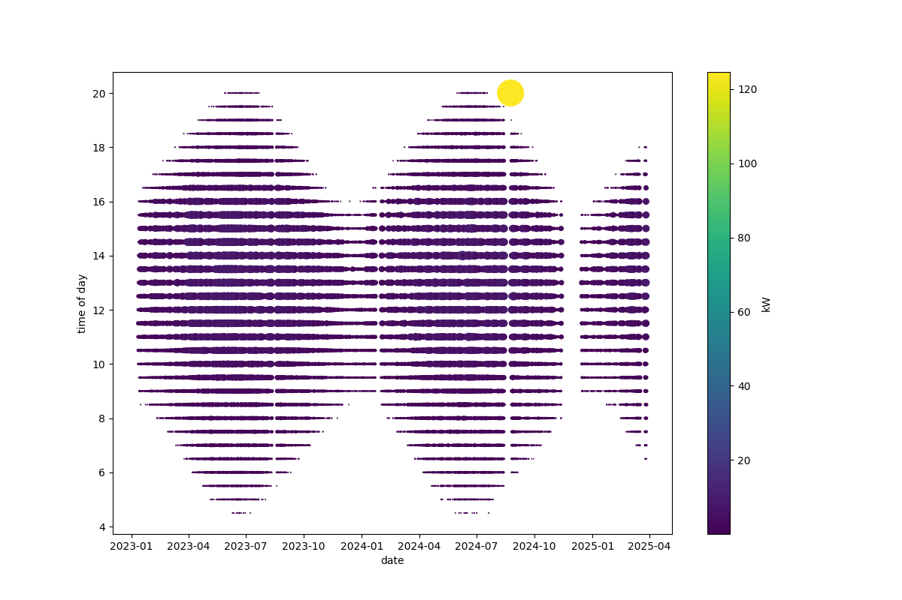

# Energy cost forecasting and solar modelling

When you have a choice of energy tariffs for a building, and are considering fabric and equipment changes you can make,
it is useful to be able to simulate what might happen in the future under different scenarios.

Currently this repo is exclusively targetting my home's solar panels, batteries, domestic electricity consumption,
and gas and electric heating but I have made a start on generalising out site specific parameters. That's partly
to avoid putting sensitive material into this public git repository.

## Step 1 - modelling solar production

Electricity import and export prices vary for me which change every 30 minutes. My electricity and gas billing metering also
captures incoming and outgoing at 30 minute resolution. So to simulate this we need to know when during the day we'll get
energy, down to at least 30 minute resolution.

There are a number of data sources we can use:

1. The electricity company meter (UK SMETS2 in my case) which produces a 30 minute time series.
2. Solar inverter monitoring (e.g. SolarEdge monitoring, 15 minute resolution)
3. Clamp transformer current monitoring (Vue Emporia, 5 second resolution)
4. Battery system monitoring (e.g. Tesla Gateway for me, 3 second resolution)
5. Weather data.

Couting up the output for each day using by clamp transformer monitoring and, when I got it, the battery system monitoring, we have:

.

Aggregating into 30 minute buckets and showing time of day on the Y axis, we have:

The structure becomes more self evident.

I then work out the peak solar output we've seen in a 30 minute period for solar azimuth and elevation, and fill in gaps using the nearest point we have:

My solar panels are on a roof facing east south east, and the treeline is fairly high in my area. Other system will get very different fingerprints.

So that's the maximum. Since I installed the system there's been a lot of cloud. We can compare what we would get by integrating the azium/elevation chart against the
sun positions for a day, which gives us a maximum, and then compare that.