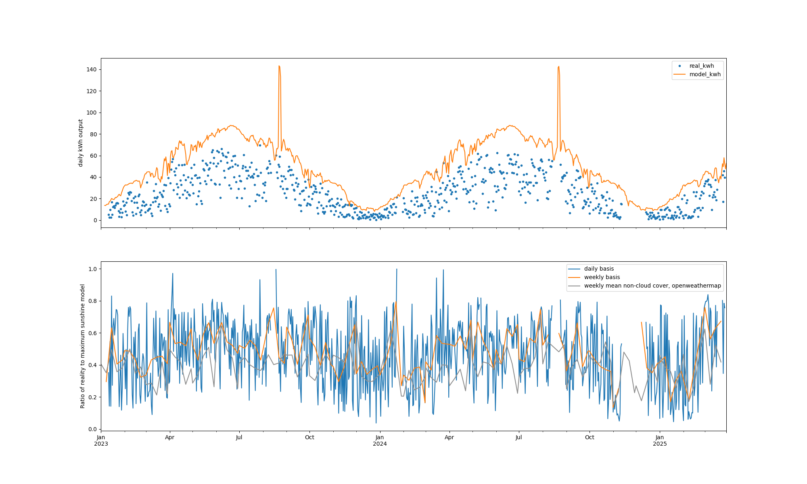

# Energy cost forecasting and solar modelling

When you have a choice of energy tariffs for a building, and are considering fabric and equipment changes you can make,
it is useful to be able to simulate what might happen in the future under different scenarios.

Currently this repo is exclusively targetting my home's solar panels, batteries, domestic electricity consumption,
and gas and electric heating but I have made a start on generalising out site specific parameters. That's partly
to avoid putting sensitive material into this public git repository.

Code is in [forceast.py](forecast.py), which requires a site specific configuration file which is not included.

## Step 1 - modelling solar production

Electricity import and export prices vary for me which change every 30 minutes. My electricity and gas billing metering also
captures incoming and outgoing at 30 minute resolution. So to simulate this we need to know when during the day we'll get
energy, down to at least 30 minute resolution.

There are a number of data sources we can use:

1. The electricity company meter (UK SMETS2 in my case) which produces a 30 minute time series.
2. Solar inverter monitoring (e.g. SolarEdge monitoring, 15 minute resolution)
3. Clamp transformer current monitoring (Vue Emporia, 5 second resolution)
4. Battery system monitoring (e.g. Tesla Gateway for me, 3 second resolution)
5. Weather data.

Couting up the output for each day using by clamp transformer monitoring and, when I got it, the battery system monitoring, we have:

.

Aggregating into 30 minute buckets and showing time of day on the Y axis, we have:

The structure becomes more self evident.

I then work out the peak solar output we've seen in a 30 minute period for solar azimuth and elevation, and fill in gaps using the nearest point we have:

My solar panels are on a roof facing east south east, and the treeline is fairly high in my area. Other system will get very different fingerprints.

So that's the maximum. Since I installed the system there's been a lot of cloud. We can compare what we would get by integrating the azium/elevation chart against the
sun positions for a day, which gives us a maximum. This can be integrated for a given day to give an approximate upper bound on what we'd get if we have clear skies all day.
This can then be plotted against the output, and bucketted to the week, to give:

# Step 2 - Energy demand modelling

Time of day matters of electricty demand matters wen considering solar power. The utility company meter gives me 30 minute resolution, when it works.
I have a [Vue Emporia energy montiros](https://www.emporiaenergy.com/energy-monitors) and I can get high resolution information from them.

# Step 3 - Battery modelling

# Step 4 - Octopus tariff integration

# Results

For my house:

To make sense of this, here's some summary and context:

 - So far, as of March 2024, my energy bills since Jan 2023 have been £1322, compared with £3418 if I'd done nothing. 
 - In the next twelve months I expect to pay about £600 for energy, compared with £3000 if I'd done nothing.   
 - The house has gas central heating, now used exclusively for radiators. Gas consumption is included in the actual data and simulations. 
   We use approximately 20,000 kWh of gas per year, currently at 7.31p/kWh, 27.47p a day standing charge, so that's about £1600 a year. 
   So without gas my electricity bill is about -£1000/year for now. I'm considering moving to heat pumps, probably air to air. That might
   half our heating cost, though saving £800/year represents a long paybaack period on an expensive air to air system, with no government help 
   (and to be fair, no VAT either). So the motivation is mainly to reduce CO2 and to provide comfort in the rare summer heatwaves.
- Hot water is handled by the system gas boiler up to March 2023, then immersion at various times of day, from March 2023 through October 2023 using
   solar power, and from October 2023 using overnight off peak electricity. This is because the gas boiler typically use 10kWh/day for hot water, and the 
   immersion heater only uses 3kWh/day. (I'm interested in hot water tank heat pumps, but the noise is a concern).
 - 11.7kW of solar panels installed in January 2023. 
 - Electricity and gas was supplied up to February 2023 by Ovo Energy on a cheap fixed tariff deal (2.66p/kWh 24.79p standing charge gas, 15.59p/kWh 23.33p standing charge electricity) which is no longer available.
 - 2 Tesla Powerwall 2 batteries installed September 2023. 13.5kWh nominal each.
 - We switched to Octopus Flux in October 2023
 - The big negative cost spikes in winter 2023/24 are Octopus Savings Sessions payments, where effectively
   the output rate shoots up for 30 to 90 minutes.
 - The scenarios in the future cover everything from what would have happened without solar or batteries and using gas for hot water, through
   to various Octous tariff combinations. It looks like if I stay with one tariff over the year for simplicity than Flux is a big win. And, surprisingly,
   Octopus Agile with dumping out the batteries when prices go high in the winter isn't worth it for us since that means forgoing the Savings Sessions payments.
   This is because Savings Sessions payments are only made relatively to what you normally do over the last 10 working days. 

- Dr. Dickon Reed, last updated 15 March 2024.
- dickon@cantab.net
